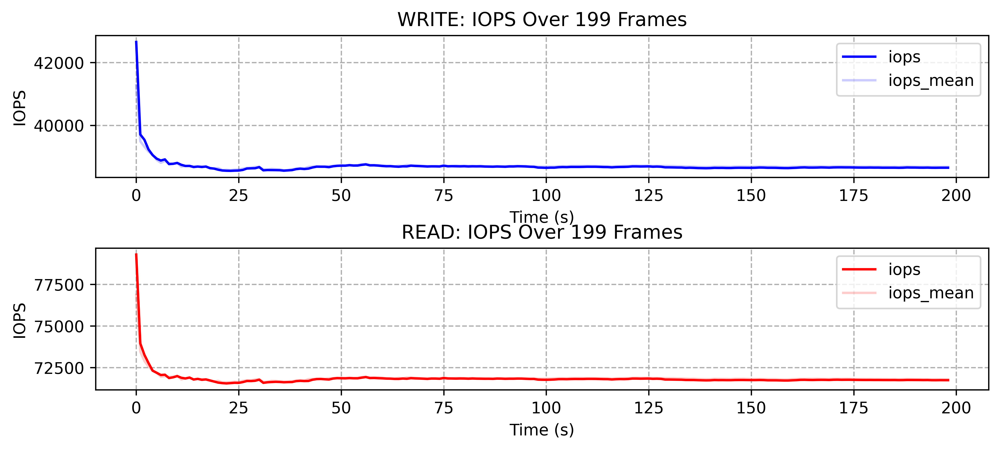
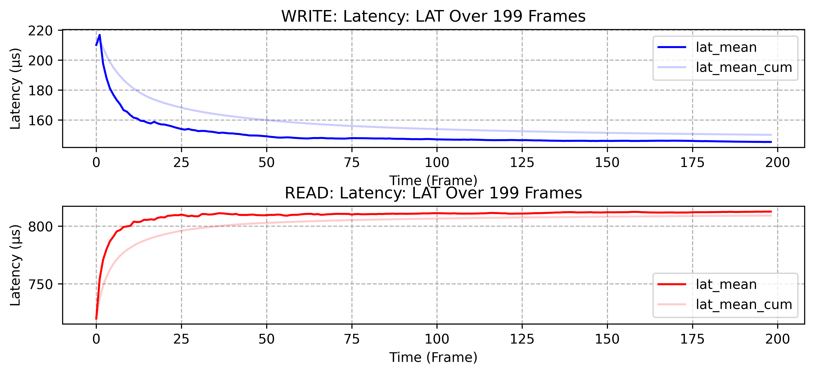
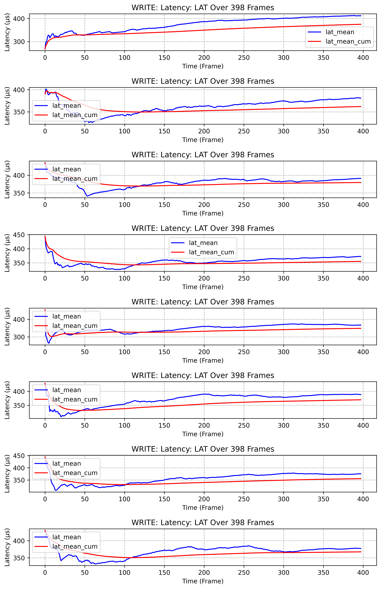

# fioer
python wrapper and default test settings for fio, ssd-test oriented

[中文](./README_CN.md)/[English](./README.md)

## example 
### 1. random read/write example

```python
from fioer.job import FioTask
import os
from pathlib import Path

template_file = "bala/randrw.fio"

randw = FioTask(work_path="./randrw",input_dict=None,)
randw.input.from_input_file(template_file)
randw.run(cli_params={"status-interval":"1"})
```

template: randrw.fio
r/w = 65/35
```ini
[global]
name=fio-rand-write
filename=fio-rand-write
rw=randrw
bs=4K
direct=1
numjobs=1
time_based=1
runtime=200
ioengine=libaio
iodepth=64
rwmixread=65

[file1]
size=10M

```


## SNIA-PTS PARAMETER TABLE
according to SNIA-PTS, section 2.1.1 

| SNIA  | FIO  | Description |
| --- | --- | --- |
| `blocksize` | `bs` | block size |
| `Read/Write` | `randrw(rwmixread=X)` | read/write |
| `OIO: Outstanding IO,/( Queue Depth)` | `iodepth` | iodepth |
| `Thread Count(Workers, Process)` | `numjobs` | number of jobs |
| `Latency` | `slat, clat, lat` | latency |
| `Cache` | `direct=1` | direct IO |


## data visualization
from data(parsed.json)

```python
randw.view.view_iops(mode="write")
randw.view.view_latency(mode="write", lat_type="lat")
```
or both plotted
```python
randw.view.view_iops(mode="both")
randw.view.view_latency(mode="both", lat_type="lat")
```

example
iops: read/write both plotted

latency: read/write both plotted

latency per job:
