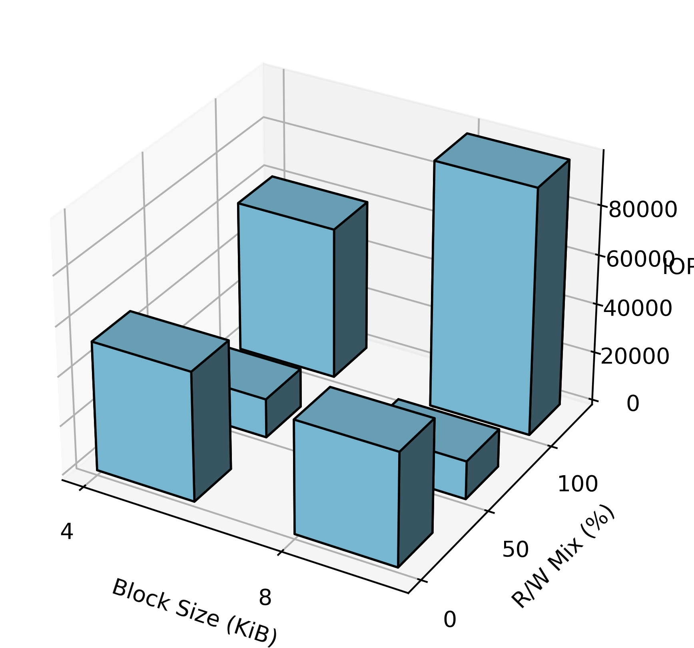

# fioer
fioer: 用于 fio 的 Python 包装器，面向SSD测试，包括数据处理和可视化

[中文](./README_CN.md)/[English](./README.md)

## 使用示例 
### 1. 随机读/写混合示例(65/35)

```python
from fioer.job import FioTask

template_file = "bala/randrw.fio"

randrw = FioTask(work_path="./randrw",input_dict=None,)
randrw.input.from_input_file(template_file)
randrw.run(cli_params={"status-interval":"1"})
```

使用模板文件 template: randrw.fio
读写比例 r/w = 65/35
```ini
[global]
name=fio-rand-write
filename=fio-rand-write
rw=randrw
bs=4K
direct=1
numjobs=1
time_based=1
runtime=200
ioengine=libaio
iodepth=64
rwmixread=65

[file1]
size=10M

```


## SNIA-PTS-FIO 参数对照表
根据 SNIA-PTS说明, 第 2.1.1 节

| SNIA  | FIO  | Description |
| --- | --- | --- |
| `blocksize` | `bs` | block size |
| `Read/Write` | `randrw(rwmixread=X)` | read/write |
| `OIO: Outstanding IO,/( Queue Depth)` | `iodepth` | iodepth |
| `Thread Count(Workers, Process)` | `numjobs` | number of jobs |
| `Latency` | `slat, clat, lat` | latency |
| `Cache` | `direct=1` | direct IO |


## 任务数据可视化示例
从json输出得到图表，from data(parsed.json)
可以 读/写可视化
```python
randrw.view.view_iops(mode="write")
randrw.view.view_latency(mode="write", lat_type="lat")
```
或者 读/写同时可视化
```python
randrw.view.view_iops(mode="both")
randrw.view.view_latency(mode="both", lat_type="lat")
```

## SNIA IOPs 测试流程(未完成，开发中)
参照snia pts v2.0.1, 第七章psedo code
```python
from fioer.flow import flow_snia_iops
flow_snia_iops(project_path="./wf",rwmix_mapping=[0,50,100], bs_mapping=[4,8])
```


### 如下图示例:

gfio like:
 


#### iops: read/write 可视化


### SNIA IOPs 测试流程 草图


#### latency: read/write 可视化

#### latency per job:
