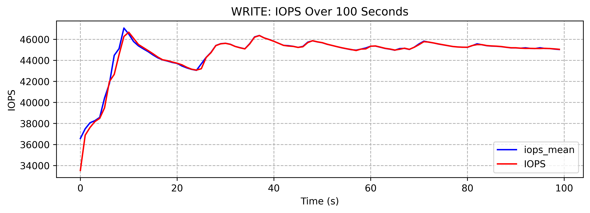
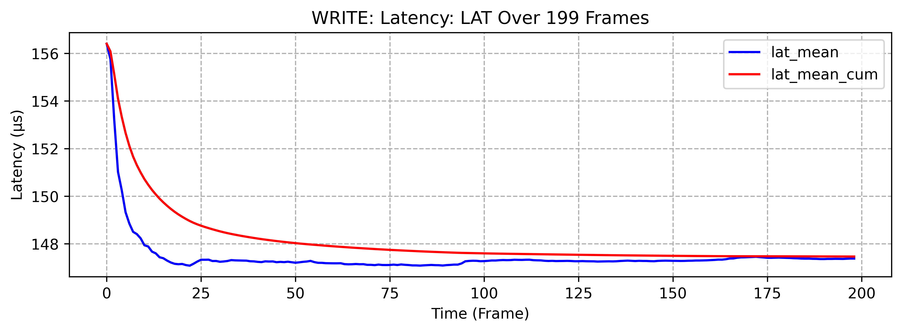

# fioer
fioer: 用于 fio 的 Python 包装器，面向SSD测试，包括数据处理和可视化

[中文](./README_CN.md)/[English](./README.md)

## 使用示例 
### 1. 随机写示例

```python
from fioer.job import FioTask
import os
from pathlib import Path

template_file = "bala/randw.fio"

randw = FioTask(work_path="./randw",input_dict=None,)
randw.input.from_input_file(template_file)
randw.run(cli_params={"status-interval":"1"})
```

使用模板文件 template: randw.fio
```ini
[global]
name=fio-rand-write
filename=fio-rand-write
rw=randwrite
bs=4K
direct=1
numjobs=8
time_based=1
runtime=200
ioengine=libaio
iodepth=16


[file1]
size=10M

```


## SNIA-PTS-FIO 参数对照表
根据 SNIA-PTS说明, 第 2.1.1 节

| SNIA  | FIO  | Description |
| --- | --- | --- |
| `blocksize` | `bs` | block size |
| `Read/Write` | `randrw(rwmixread=X)` | read/write |
| `OIO: Outstanding IO,/( Queue Depth)` | `iodepth` | iodepth |
| `Thread Count(Workers, Process)` | `numjobs` | number of jobs |
| `Latency` | `slat, clat, lat` | latency |
| `Cache` | `direct=1` | direct IO |


## 任务数据可视化示例
从json输出得到图表，from data(parsed.json)

```python
randw.view.view_iops(mode="write")
randw.view.view_latency(mode="write", lat_type="lat")
```
如图所示



总延迟-时间变化 (per job)
